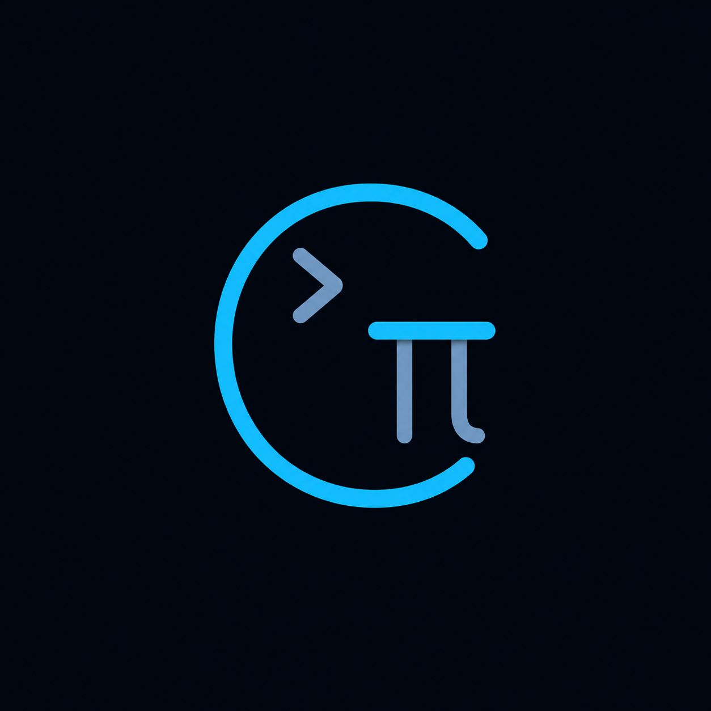
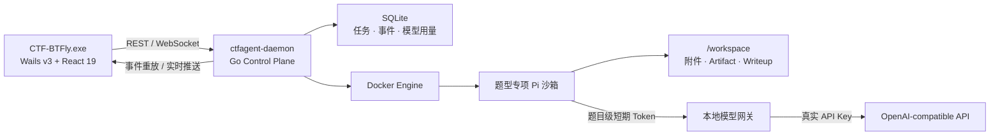

<div align="center">
  
  <h1>CTF-BTFly</h1>
  <p><strong>自动化 CTF 解题工作台</strong></p>
  <p>
    将桌面工作台、独立 Go 控制平面、Docker 隔离沙箱、Pi Agent 与模型网关组合在一起，<br />
    为每道 CTF 题目提供可观察、可复现、可人工接管的自主分析环境。
  </p>
  <p>
    
    
    
    
    
    
    
  </p>
</div>


> [!CAUTION]
> CTF-BTFly 只能用于明确授权的 CTF 题目、靶场和安全研究环境。  
> 请勿使用本项目扫描、测试或攻击未授权目标，也不要把比赛附件、Flag、凭据或私有数据上传到第三方服务。

## 目录

- [项目简介](#项目简介)
- [图文说明与更新记录](#图文说明与更新记录)
- [1.3.1 功能更新](#131-功能更新)
- [核心能力](#核心能力)
- [系统架构](#系统架构)
- [快速开始](#快速开始)
- [模型网关配置](#模型网关配置)
- [使用流程](#使用流程)
- [沙箱与安全模型](#沙箱与安全模型)
- [题型与专项镜像](#题型与专项镜像)
- [项目结构](#项目结构)
- [开发与验证](#开发与验证)
- [当前限制](#当前限制)

## 项目简介

CTF-BTFly 将 GUI 与高权限控制平面分离：

- **Wails + React 桌面端**负责题目管理、状态展示、事件时间线、文件预览、Writeup 和模型用量；
- **独立 Go daemon**负责 SQLite、Docker、任务状态机、模型凭据和 Agent 生命周期；
- **每题一个 Docker 沙箱**，根据题型加载 Web、Crypto、Pwn、Reverse、Forensics 或 Misc 专项工具；
- **Pi RPC Agent**在容器内自主分析附件、执行命令、编写脚本并生成中文 `WRITEUP.md`；
- **本地模型网关**把题目级短期 Token 替换为真实上游 Key，真实密钥不会进入容器或前端。

任务事件会先写入 SQLite，再通过 WebSocket 实时推送。前端断线或切换页面后，可以根据单调递增的 `sequence` 补齐历史。

## 图文说明与更新记录

项目图文说明和版本更新记录发布于：

- [CTF-BTFly 图文说明（一）](https://mp.weixin.qq.com/s/RLU-ROZ0YfjJMzR3BDdl8g)
- [CTF-BTFly 图文说明（二）](https://mp.weixin.qq.com/s/_bZ32TZykNCsyjqdLdRVXw)
- [CTF-BTFly 图文说明（三）](https://mp.weixin.qq.com/s/9Tznr2-ZnFP9knj2J3CqFg)

## 1.3.1 功能更新

### 模型配置与兼容性

- 在桌面端新增或编辑模型后，daemon 会原子热更新模型池；检测模型下拉框和新建题目模型列表立即刷新，无需重启程序；
- 已配置模型支持右键删除，并在模态窗口中二次确认；只要仍有 `ready`、`queued`、`provisioning`、`running`、`paused` 等未结束题目使用该模型，后端就会拒绝删除；
- 删除保护兼容旧数据库中仅保存 `model_id`、尚未保存 `model_profile` 的题目；删除默认模型后会自动切换到剩余模型，删除最后一个模型时会完整清理旧配置，避免配置“复活”；
- 模型 ID 以 `deepseek` 开头时，仅针对该模型把 Chat Completions 请求中的 `developer` 角色改写为 `system`，其他 OpenAI-compatible 模型保持原始角色；
- `CTF_MODEL_*_SUPPORTS_IMAGES=false` 会继续阻止图片内容块发往不支持视觉输入的模型。

### 题目创建与桌面交互

- Web、Crypto、Pwn、Reverse、Forensics、Misc 分类内容区支持直接拖入文件或文件夹，自动打开新建题目窗口、预选当前题型并保留附件目录结构；
- Wails v3 主窗口已启用原生外部文件投放，支持从 Windows 资源管理器拖入文件；进入有效区域时会显示高亮反馈；
- 原始数据、工作区文件、Flag、命令输出和解题报告恢复文本选择与复制，并提高选区背景对比度；
- 左下角新增宿主机 CPU 与物理内存占用，随系统状态轮询更新，不采集进程列表、主机名或路径。

### Flag 候选识别

- 根据题目填写的 Flag 格式生成安全匹配规则，综合实时 Agent/工具事件和 `WRITEUP.md` 识别候选；
- 支持中英文最终 Flag 标题、代码块、行内代码及 `Flag:` 标签，并区分“候选”与“已验证结果”；
- 对候选按值去重并保留来源、置信度和格式命中状态，降低格式提示不准确或输出位置变化造成的漏识别。

## 核心能力

| 能力 | 说明 |
|---|---|
| 本地桌面工作台 | 创建题目、分类筛选、实时状态、主题切换、右键清理、CPU/内存监控 |
| 独立控制平面 | GUI 退出或隐藏后，daemon 可继续管理正在运行的任务 |
| 一题一沙箱 | 每道题拥有独立容器、工作区、Agent 会话和短期模型 Token |
| 六类专项镜像 | Web、Crypto、Pwn、Reverse、Forensics、Misc |
| 实时事件流 | Agent 消息、工具调用、stderr、沙箱状态和 Flag 候选统一记录 |
| 断线重放 | SQLite 持久事件与 WebSocket 实时事件按序号合并 |
| 附件与 Artifact | 支持分类区拖入文件/文件夹创建题目、工作区浏览、文本复制和原文件下载 |
| 强制中文 Writeup | Agent 必须生成可复现的 `WRITEUP.md` 和关键分析产物 |
| Flag 候选识别 | 综合预期格式、实时事件与最终报告，区分候选和已验证结果 |
| 暂停与恢复 | 保留原容器、Pi 会话和工作区，继续同一次解题上下文 |
| 模型用量账本 | 记录请求数、输入/输出/缓存/推理 Token 和按题目/日期聚合 |
| 多模型热更新 | 桌面端新增、编辑、检测和安全删除模型，无需重启 daemon |
| DeepSeek 适配 | DeepSeek 请求自动执行 `developer → system`，不影响其他模型 |
| 受控专项协作 | 根 Agent 可按证据创建最多 3 个隔离专项子任务；支持全部六类题型，子任务结果会回传供主 Agent 复现与整合 |

## 系统架构



任务执行链：

```text
创建题目并上传附件
  → daemon 创建独立工作区
  → 根据题型选择专项镜像
  → 创建 Docker 容器并启动 Pi RPC
  → Agent 分析附件、执行工具、保存 Artifact
  → JSONL 事件写入 SQLite 并推送到 GUI
  → 生成中文 WRITEUP.md
  → 提取最终 Flag 或保留失败证据供人工接管
```

## 快速开始

### 1. 环境要求

- Go 1.26；
- Node.js 24+ 与 npm；
- Docker Desktop 或 Docker Engine；
- Wails v3 CLI；
- 可用的 OpenAI-compatible 模型接口；
- Windows 为当前主要开发和验证平台。

线上处理不可信题目时，建议在 Linux Worker 上使用：

- 普通题：gVisor / `runsc`；
- Pwn：Kata Containers 或独立虚拟机。

### 2. 安装前端依赖

```powershell
cd frontend
npm ci
cd ..
```

### 3. 配置模型网关

在最终 `CTF-BTFly.exe` 所在目录创建 `.env`。开发构建默认产物位于 `bin/`，因此通常创建 `bin/.env`：

```env
CTF_UPSTREAM_MODEL_BASE_URL=https://your-openai-compatible-endpoint/v1
CTF_UPSTREAM_MODEL_API_KEY=your-real-provider-key
CTF_MODEL_ID=your-model-id
CTF_MODEL_INCLUDE_STREAM_USAGE=true
CTF_MODEL_SUPPORTS_IMAGES=false
# 多模型（可选）：设置 CTF_MODELS 后会优先使用以下配置，旧单模型变量仍兼容。
CTF_MODELS=deepseek,vision
CTF_DEFAULT_MODEL=deepseek
CTF_MODEL_DEEPSEEK_BASE_URL=https://api.deepseek.com/v1
CTF_MODEL_DEEPSEEK_API_KEY=your-deepseek-key
CTF_MODEL_DEEPSEEK_ID=deepseek-chat
CTF_MODEL_DEEPSEEK_SUPPORTS_IMAGES=false
CTF_MODEL_VISION_BASE_URL=https://your-vision-endpoint/v1
CTF_MODEL_VISION_API_KEY=your-vision-key
CTF_MODEL_VISION_ID=your-vision-model
CTF_MODEL_VISION_SUPPORTS_IMAGES=true

```

> [!IMPORTANT]
> `.env` 包含真实模型密钥，不要提交到 Git、复制进 Docker 镜像或放入题目工作区。

桌面端可在“系统概况 → 模型连接 → 管理模型”中新建或编辑多个配置；界面只显示 URL、模型 ID、能力开关和“密钥已设置”状态，绝不会回显 API Key。保存或“重新读取并检测”会原子热更新模型池，新配置会立即出现在检测模型和新建题目下拉框中，运行中题目仍保留原连接和短期 Token，无需重启 daemon/桌面程序。

已保存模型可通过右键菜单删除。删除操作需要模态确认；后端会独立检查所有未结束题目，如果仍有题目使用该模型则返回冲突并保留配置。删除 `.env` 中的模型同时会移除对应 API Key，因此该操作不可撤销。

### 4. 构建专项镜像

```powershell
.\images\build.ps1 -Version 0.1.0
```

首次构建需要下载 Node、Python、Debian 软件包和各题型工具，耗时取决于网络与 Docker 缓存。

### 5. 启动开发环境

```powershell
# 构建独立 daemon
wails3 task daemon:build

# 启动 Wails + Vite 开发环境
wails3 task dev
```

也可以单独运行控制平面：

```powershell
wails3 task daemon:run
```

### 6. 构建桌面程序

```powershell
wails3 build
```

主要产物：

```text
bin/
├── CTF-BTFly.exe
└── ctfagent-daemon.exe
```

GUI 启动时会优先连接已有 daemon；未检测到可用实例时，会自动启动同目录的 `ctfagent-daemon.exe`。

## 模型网关配置

| 环境变量 | 必填 | 默认值 | 作用 |
|---|---:|---|---|
| `CTF_UPSTREAM_MODEL_BASE_URL` | 是 | — | OpenAI-compatible API 基础地址 |
| `CTF_UPSTREAM_MODEL_API_KEY` | 是 | — | 真实上游 API Key，仅 daemon 持有 |
| `CTF_MODEL_ID` | 是 | — | Agent 使用的模型 ID |
| `CTF_MODEL_INCLUDE_STREAM_USAGE` | 否 | `true` | 为流式请求加入 `stream_options.include_usage` |
| `CTF_MODEL_SUPPORTS_IMAGES` | 否 | `false` | 仅在上游明确兼容 OpenAI `image_url` 内容块时设为 `true`；DeepSeek 应保持 `false` |
| `CTF_AGENT_ENV_FILE` | 否 | 程序同目录 `.env` | 显式指定 daemon 配置文件 |
| `CTF_AGENT_DATA_DIR` | 否 | 程序同目录 `data/` | 覆盖 SQLite、日志和工作区目录 |
| `CTF_DAEMON_ADDRESS` | 否 | `127.0.0.1:18731` | daemon 监听地址 |
| `CTF_DAEMON_TOKEN` | 否 | 自动安全生成 | 覆盖本地控制平面 Token |
| `CTF_DAEMON_EXECUTABLE` | 否 | 自动查找 | GUI 启动的 daemon 路径 |
| `DOCKER_HOST` | 否 | Docker SDK 默认 | 指定 Docker Engine |

daemon 会为每次任务启动签发随机短期 Token。容器通过：

```text
http://host.docker.internal:<daemon-port>/model
```

访问本地模型网关。SQLite 用量账本只保存模型名、Token 数、状态码和耗时，不保存 Prompt、回复、请求头或真实 Key。

## 使用流程

1. 点击“新建题目”，或进入某一题型分类后直接把文件/文件夹拖入内容区；
2. 确认自动选择的题型，并填写题目描述、授权目标和 Flag 格式；
3. 检查已带入的附件及目录结构；
4. 启动任务，观察沙箱状态和实时分析时间线；
5. 必要时暂停任务，补充线索后恢复原 Pi 会话；
6. 在“文件”页查看脚本、响应和分析产物；
7. 在“Writeup”页查看或下载完整中文题解；
8. 任务结束后关闭容器释放资源，或保留实例进行人工检查；
9. 对已结束任务可重新尝试或永久删除。

每道题的默认工作区结构：

```text
data/workspaces/task_xxx/
├── attachments/       用户上传的题目附件
├── artifacts/         Agent 保存的脚本、响应和证据
├── .pi-sessions/      Pi 会话数据
└── WRITEUP.md         中文可复现解题报告
```

## 沙箱与安全模型

| 控制项 | 当前策略 |
|---|---|
| 默认内存 | 4 GiB |
| 默认 CPU | 4 核配额 |
| 默认 PID | 512 |
| Linux capabilities | 默认全部移除 |
| Pwn 额外能力 | `SYS_PTRACE` |
| `no-new-privileges` | 启用 |
| Docker Socket | 不挂载 |
| 宿主机目录 | 只挂载当前题目工作区 |
| 模型凭据 | 容器只获得任务级短期 Token |
| 普通题运行时 | 优先 gVisor，开发环境可降级 runc |
| Pwn 运行时 | 优先 Kata，开发环境可降级 runc |

> [!WARNING]
> 当前实现仍使用 Docker bridge 网络，尚未在网络层强制目标白名单。  
> `runc` 降级模式只适合本地开发和可信题目；不要把它视为针对恶意二进制的强隔离边界。

更完整的边界、已知风险和修复建议见[代码审计报告](./docs/代码审计报告.md)。

## 题型与专项镜像

| 题型 | 镜像 | 代表工具 | 目标运行时 |
|---|---|---|---|
| Web | `ctf-agent-pi-web:0.1.0` | Nmap、SQLMap、Gobuster、WhatWeb | gVisor |
| Crypto | `ctf-agent-pi-crypto:0.1.0` | John、gmpy2、PyCryptodome、SymPy、Z3 | gVisor |
| Pwn | `ctf-agent-pi-pwn:0.1.0` | GDB、QEMU、Pwntools、Ropper、Checksec | Kata/VM |
| Reverse | `ctf-agent-pi-reverse:0.1.0` | Apktool、angr、GDB、Strace、Ltrace | gVisor/Kata |
| Forensics | `ctf-agent-pi-forensics:0.1.0` | Binwalk、Tshark、Yara、Sleuth Kit、Volatility | gVisor/Kata |
| Misc | `ctf-agent-pi-misc:0.1.0` | FFmpeg、ImageMagick、Steghide、ZBar、SciPy | gVisor |

镜像详细说明见 [`images/README.md`](./images/README.md)。

## 项目结构

```text
CTFAgentPi/
├── agents/                  Pi 通用规则、Provider 与题型入口 Skill
├── build/                   Wails 跨平台构建和打包配置
├── cmd/daemon/              独立 Go daemon 入口
├── docs/                    项目结构与代码审计文档
├── frontend/                React + TypeScript + Tailwind 桌面前端
├── images/                  基础与六类专项 Docker 镜像
├── internal/
│   ├── agent/               任务编排、Pi RPC、Flag 与受控专项协作
│   ├── api/                 REST、WebSocket、鉴权、上传和下载
│   ├── appdata/             数据目录、连接文件和 daemon Token
│   ├── buildinfo/           统一应用版本信息
│   ├── daemon/              控制平面依赖装配与生命周期
│   ├── envfile/             本地 .env 解析
│   ├── eventhub/            进程内实时事件广播
│   ├── modelgateway/        多模型热更新、反向代理与 Token 用量
│   ├── platform/            核心领域模型
│   ├── sandbox/             Docker 沙箱管理
│   ├── storage/             SQLite 数据访问
│   └── systemstats/         Windows CPU 与物理内存采样
├── skills/                  CTF 方法与参考资料库
├── main.go                  Wails 桌面入口
├── desktopservice.go        GUI 与 daemon 桥接
├── Taskfile.yml             开发、构建和打包任务
└── go.mod                   Go 模块定义
```

完整逐文件说明见[项目结构说明](./docs/项目结构说明.md)。

## 开发与验证

```powershell
# Go 全量测试
go test ./...

# Go 静态检查
go vet ./...

# 前端类型检查与生产构建
cd frontend
npm run build
cd ..

# 构建独立 daemon
go build -buildvcs=false -o "bin\ctfagent-daemon.exe" .\cmd\daemon

# 构建桌面程序
wails3 build
```

当前测试覆盖：

- SQLite 任务、事件序号与断线重放；
- 父子任务模型用量聚合；
- 模型短期 Token 替换和 usage 解析；
- DeepSeek `developer → system` 定向改写及非 DeepSeek 不改写；
- 多模型热更新、删除最后一个模型及未结束题目删除保护；
- 流式请求自动加入 usage 选项；
- HTTP 鉴权、任务创建与事件查询；
- Pi 文本和工具事件标准化；
- `.env` 优先级与错误输入；
- 附件基础目录穿越检查；
- Flag 格式匹配、实时候选检测与最终章节提取；
- Windows CPU/内存采样及异常计数边界。

## 当前限制

- Windows 是当前主要支持平台，其他 Wails 平台尚未完成 CTF 工具链验证；
- Docker bridge 网络尚未强制授权目标白名单；
- gVisor/Kata 不可用时会回退 runc 开发模式；
- “终端”页是 Pi 工具输出转录，不是交互式 PTY；
- 每个根任务整个生命周期最多可创建 3 个子 Agent；子任务不能继续委派，最终判断与 Writeup 始终由根 Agent 负责；
- daemon 异常重启后的活跃任务状态恢复仍需完善；
- 工作区、事件和模型流式缓冲仍需增加更完整的配额边界。

## 最后

**1.3.1为最新版，因研究agent没有时间，此后一段时间不再更新/修复bug，优化agent的版本将第一时间在交流群和公众号发布说明。**

欢迎交流:921416626