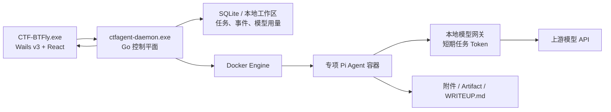
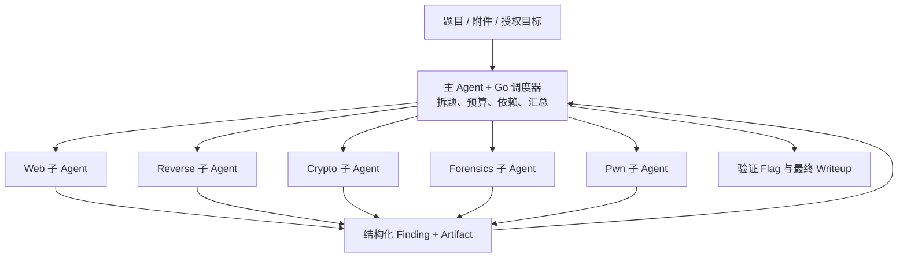

# CTF-BTFly 项目结构与文件说明

> 最后更新：2026-07-23  
> 适用版本：CTF-BTFly 0.1.0

CTF-BTFly 是一个本地优先的 CTF 自主解题工作台。桌面 GUI 负责操作与展示；独立 Go daemon 负责题目、Docker、Pi Agent、模型网关、日志、文件与任务生命周期；每道题在独立 Docker 容器中运行对应方向的 Pi Agent。

## 1. 总体架构



运行过程：

```text
创建题目 + 上传附件
  → daemon 创建独立工作区
  → 根据题型选择 Docker 镜像
  → 容器中以 Pi RPC 模式启动 Agent
  → Agent 自主执行工具、生成 Artifact 与 WRITEUP.md
  → daemon 将 JSONL 事件写入 SQLite 并经 WebSocket 推送到 GUI
```

## 2. 顶层目录

```text
CTFAgentPi/
├── agents/                 Pi 的通用与专项行为配置
├── bin/                    本地构建出的 Windows 可执行文件与运行配置
├── build/                  Wails 跨平台打包配置与图标
├── cmd/                    可执行程序入口
├── docs/                   项目文档
├── frontend/               React 前端
├── images/                 Docker Agent 镜像定义
├── internal/               Go 控制平面核心实现
├── skills/                 CTF 方法与参考资料库
├── main.go                 Wails 桌面程序入口
├── desktopservice.go       GUI 与 daemon 的桥接服务
├── go.mod / go.sum         Go 依赖定义与锁定
├── Taskfile.yml            构建任务入口
├── README.md               项目简介
└── CTF-BTFly-安装使用与安全指南.md  安装、使用与安全说明
```

## 3. 桌面程序

### `main.go`

Wails 桌面应用入口。

- 将 `frontend/dist` 嵌入最终 `CTF-BTFly.exe`；
- 创建 CTF-BTFly 主窗口，默认尺寸为 1440×900；
- 创建系统托盘菜单；
- 关闭窗口时隐藏到托盘，而不是退出；
- 从托盘退出时调用 `DesktopService.PrepareExit()`；若有运行中任务，则阻止退出并展示任务列表。

### `desktopservice.go`

Wails 暴露给 React 的桌面能力。

- 读取 daemon 连接文件，检测已有 daemon 是否存活；
- 没有可用 daemon 时，自动启动 `ctfagent-daemon.exe`；
- 启动时将与 `CTF-BTFly.exe` 同目录的 `.env` 通过 `CTF_AGENT_ENV_FILE` 传给 daemon；
- 调用 daemon 的安全关闭接口，避免 GUI 退出时误终止正在运行的容器。

### `process_windows.go` / `process_other.go`

- `process_windows.go`：Windows 下以隐藏窗口方式启动 daemon；
- `process_other.go`：非 Windows 平台使用空实现，保证代码可跨平台编译。

## 4. 独立 daemon

### `cmd/daemon/main.go`

`ctfagent-daemon.exe` 的入口，仅调用 `internal/daemon.Run()` 并记录致命错误。

### `internal/daemon/run.go`

控制平面装配入口，负责依次初始化：

1. `.env` 配置；
2. 本地数据目录与 daemon Token；
3. SQLite；
4. Docker Sandbox Manager；
5. 模型网关；
6. 事件广播中心；
7. Agent 服务；
8. REST/WebSocket API 服务。

默认仅监听本机 `127.0.0.1:17321`。

## 5. 本地数据与配置

### `internal/appdata/paths.go`

管理运行时文件位置。默认路径是 `CTF-BTFly.exe`（以及 `ctfagent-daemon.exe`）同目录的 `data/` 文件夹；也可通过 `CTF_AGENT_DATA_DIR` 覆盖。

```text
bin\data\
    ├── platform.db       SQLite：任务、状态、事件、模型用量账本
├── daemon.json       GUI 连接地址与本地鉴权 Token
├── daemon.token      daemon 鉴权 Token
├── daemon.log        后台日志
└── workspaces\
    └── task_xxx\
        ├── attachments\
        ├── artifacts\
        ├── WRITEUP.md
        └── .pi-sessions\
```

### `internal/envfile/envfile.go`

解析本地 `.env` 文件。

- 已设置的系统环境变量优先于 `.env`；
- 打包后的桌面版读取 `bin\.env`；
- `.env` 绝不能提交到 GitHub 或发送给他人；
- 建议使用 `.env.example` 作为无密钥模板。

关键配置：

```env
CTF_UPSTREAM_MODEL_BASE_URL=https://your-model-gateway.example/v1
CTF_UPSTREAM_MODEL_API_KEY=replace-with-your-api-key
CTF_MODEL_ID=your-model-id
CTF_MODEL_INCLUDE_STREAM_USAGE=true
DOCKER_HOST=npipe:////./pipe/dockerDesktopLinuxEngine
```

`internal/envfile/envfile_test.go` 用于测试合法配置、引号、错误行及环境变量优先级。

## 6. 领域模型与 SQLite

### `internal/platform/model.go`

定义平台核心类型：

- 题型：`web`、`crypto`、`pwn`、`reverse`、`forensics`、`misc`；
- 状态：`ready`、`provisioning`、`running`、`paused`、`settled`、`failed`、`cancelled`；
- `Task`：题目、镜像、容器、补充提示、父子任务关联；
- `Event`：按题目递增编号的统一事件格式；
- `ModelUsage`、`ModelUsageReport`：模型请求、按题目与按日期的 Token 聚合结果。

### `internal/storage/sqlite.go`

SQLite 数据访问层。

`tasks` 保存题目、镜像、状态、容器 ID、用户补充提示和父子交接关系；`task_events` 保存 Agent、工具、系统与交接事件；`model_usage` 保存每次模型调用的题目 ID、模型名、输入/输出/总 Token、状态码和耗时。数据库使用 WAL 模式，并支持旧数据库的增量迁移。

模型账本不保存 Prompt、上游模型回复、请求头或 API Key。专项子任务的用量在查询时自动归并到可见的父题目。

`internal/storage/sqlite_test.go` 测试迁移、任务保存与事件序列。

## 7. REST、WebSocket 与事件流

### `internal/api/server.go`

本地 API 服务。

- 对 `/api/*` 与 `/ws/*` 实施 daemon Token 鉴权；
- 管理题目创建、删除、附件上传、提示词、开始、暂停、恢复、中止、重试和关闭容器；
- 提供工作区文件浏览、下载和 Writeup 获取；
- 使用 WebSocket 推送实时 Agent 事件；
- daemon 退出请求会检查运行中任务。

主要接口：

```text
GET    /api/system
GET    /api/model-usage
GET    /api/tasks
POST   /api/tasks
DELETE /api/tasks/{id}

POST   /api/tasks/{id}/attachments
GET    /api/tasks/{id}/prompt
PUT    /api/tasks/{id}/prompt

POST   /api/tasks/{id}/start
POST   /api/tasks/{id}/pause
POST   /api/tasks/{id}/resume
POST   /api/tasks/{id}/abort
POST   /api/tasks/{id}/retry
POST   /api/tasks/{id}/close-sandbox

GET    /api/tasks/{id}/events
GET    /api/tasks/{id}/files
GET    /api/tasks/{id}/file
GET    /api/tasks/{id}/download
GET    /api/tasks/{id}/writeup
WS     /ws/tasks/{id}
```

`internal/api/server_test.go` 测试 API 鉴权和主要端点。

### `internal/eventhub/hub.go`

内存事件广播器。SQLite 是持久化事实来源；前端 WebSocket 掉线或切换页面后，可依据 `sequence` 从 SQLite 补齐事件。

## 8. 模型网关

### `internal/modelgateway/gateway.go`

模型网关的职责：

- 保存真实上游模型 API Key；
- 给每个题目签发随机短期 Token；
- 容器只携带任务 Token；
- 校验 Token 后反向代理请求到上游模型；
- 从普通 JSON 与 SSE 流式响应解析上游 `usage`，记录模型名、题目、输入/输出/总 Token、状态和耗时；
- 默认向 OpenAI 兼容的流式 `/chat/completions` 请求补充 `stream_options.include_usage=true`；可用 `CTF_MODEL_INCLUDE_STREAM_USAGE=false` 为不兼容的上游关闭；
- 避免真实 Key 直接出现在 Docker 容器、Pi 配置或前端中。

`internal/modelgateway/gateway_test.go` 测试 Token 签发与校验、OpenAI 兼容 usage 解析与流式 usage 请求参数。

## 9. Docker 沙箱

### `internal/sandbox/manager.go`

Docker SDK 封装层。

- 根据题型选择 `ctf-agent-pi-*` 镜像；
- 在容器中启动 `pi --mode rpc`；
- 将题目工作区挂载为 `/workspace`；
- 通过 stdin 向 Pi 发送 JSONL Prompt；
- 读取 stdout/stderr，供 Agent 服务处理；
- 实现中止、恢复、停止和删除容器；
- 普通题优先 `runsc`/gVisor，Pwn 优先 Kata；本地开发无法使用时回退 `runc`。

当前限制：

```text
默认：4 GB 内存、4 CPU、512 进程
Capabilities：默认全部移除
Pwn：额外 SYS_PTRACE
安全选项：no-new-privileges=true
Docker Socket：不挂载
宿主机目录：仅挂载当前题目 workspace
```

> 注意：当前实现仍使用 Docker bridge 网络，目标白名单尚未由网络层强制执行。只能对明确授权的 CTF 靶场或比赛目标使用。

## 10. Agent 编排

### `internal/agent/service.go`

Agent 服务核心。

- 创建题目、分配题型镜像；
- 将拖拽上传的文件复制至 `attachments/`；
- 启动 Pi RPC 并规范化 Pi JSONL 事件；
- 将事件持久化到 SQLite 并实时广播；
- 支持暂停、恢复、中止、重试、关闭实例和删除题目；
- 生成不可由前端绕过的系统提示词；
- 强制 Agent 输出 `WRITEUP.md`；
- 仅从 `## 最终 Flag` 下的代码块提取已验证 Flag，避免日志中的错误匹配。

提示词的关键策略：

```text
先根据题目、附件和工具输出独立初判
→ 只在证据或阻塞点匹配时读取 Skill
→ 必要时检索公开历史题目和公开 Writeup
→ 自行复现和验证，而不是直接照搬网络答案
→ 记录 Artifact、完整中文 Writeup 与最终 Flag
```

### `internal/agent/handoff.go`

当前已实现的专项协作是 `Misc → Crypto`：

```text
Misc Agent 发现密码学核心难点
→ 保存参数与 Artifact
→ 写入 .cpi/handoff/crypto-request.json
→ CTF-BTFly 创建 Crypto 子任务
→ 复制必要输入到子工作区
→ Crypto Agent 解题并生成报告/脚本
→ CTF-BTFly 回传结果到父任务 artifacts/handoffs/
→ 关闭 Crypto 子容器并重新启动 Misc 继续解题
```

`internal/agent/service_test.go` 测试 Pi 事件转换、附件路径安全和 Flag 提取逻辑。

## 11. React 前端

### `frontend/src/main.tsx`

React 入口，创建 TanStack Query Client 并挂载 `App`。

### `frontend/src/App.tsx`

当前前端的主要界面文件，包含：

- 系统概况、全部题目、运行中任务、题型筛选；
- 新建题目、拖拽文件/文件夹附件；
- 任务操作：开始、暂停、恢复、中止、重新尝试、关闭实例；
- 解题过程时间线、运行时长、容器状态；
- 系统提示词与用户补充提示；
- Pi 工具输出转录；
- 工作区文件预览和下载；
- `WRITEUP.md` 预览与下载；
- Flag 显示、复制和 Windows 成功通知；
- 模型用量页：总 Token、按日期柱状图、按题目汇总和模型名称；
- 右键删除与关闭实例确认对话框。

### `frontend/src/lib/`

| 文件 | 作用 |
|---|---|
| `api.ts` | daemon REST/WebSocket 客户端。 |
| `types.ts` | 前端任务、事件、文件、系统状态 TypeScript 类型。 |
| `useTaskEvents.ts` | 按题目缓存事件、重连 WebSocket、REST 补历史，减少切换题目时的重绘闪屏。 |
| `utils.ts` | Tailwind 类名合并、Pi 文本和工具输出提取。 |

### `frontend/src/components/ui/`

- `button.tsx`：通用按钮；
- `badge.tsx`：通用状态标签。

### 前端构建相关文件

| 文件/目录 | 作用 |
|---|---|
| `frontend/package.json` | 前端依赖与构建命令。 |
| `frontend/package-lock.json` | npm 依赖锁文件，应提交。 |
| `frontend/vite.config.ts` | Vite 配置。 |
| `frontend/tsconfig.json` | TypeScript 配置。 |
| `frontend/index.html` | Vite 页面入口。 |
| `frontend/public/` | 图标、字体和静态资源。 |
| `frontend/bindings/` | Wails 自动生成的 TypeScript 绑定，不手工修改。 |
| `frontend/dist/` | 前端构建产物，由 Go 嵌入，不提交。 |
| `frontend/node_modules/` | npm 第三方依赖，不提交。 |

> 当前“终端”页展示的是 Pi 自动执行记录，并非用户可交互的 PTY Shell；虽然项目已安装 xterm.js 依赖，但尚未接入交互式终端会话。

## 12. Docker 镜像

### `images/base/Dockerfile`

所有专项镜像的基础：Python 3.12、Node 24、Pi Agent、通用 Shell/文件工具、通用 Pi 配置和完整跨方向 Skill 库。

### 专项 Dockerfile

| 文件 | 主要内容 |
|---|---|
| `images/web/Dockerfile` | Nmap、SQLMap、Gobuster、WhatWeb、Dirb、HTTP/JWT Python 工具。 |
| `images/crypto/Dockerfile` | John、gmpy2、PyCryptodome、SymPy、Z3。 |
| `images/pwn/Dockerfile` | GDB、QEMU、Pwntools、Ropper、Patchelf、Checksec。 |
| `images/reverse/Dockerfile` | Apktool、angr、JRE、GDB、Strace、Ltrace。 |
| `images/forensics/Dockerfile` | Binwalk、Foremost、Tshark、Yara、Sleuth Kit、Volatility。 |
| `images/misc/Dockerfile` | FFmpeg、ImageMagick、Steghide、ZBar、NumPy、SciPy、Pillow。 |

`images/build.ps1` 批量构建镜像；`images/README.md` 说明镜像和运行时策略。

## 13. Pi Agent 配置与 Skills

### `agents/`

```text
agents/common/AGENTS.md                         所有 Agent 的通用规则
agents/common/extensions/platform-provider.ts    Pi 模型网关 Provider
agents/common/skills/ctf-workflow/SKILL.md       通用 CTF 工作流
agents/{web,crypto,pwn,reverse,forensics,misc}/SKILL.md
                                                  各方向入口 Skill
```

### `skills/`

完整资料库；每个方向均含 `SKILL.md` 与 `references/*.md`：

```text
skills/web/         Web 漏洞、认证、JWT、反序列化、Web3、CVE
skills/crypto/      RSA、ECC、格攻击、PRNG、流密码、ZKP
skills/pwn/         栈/堆、ROP、格式化字符串、FSOP、内核利用
skills/reverse/     反调试、静态/动态分析、模拟、平台与工具
skills/forensics/   磁盘/内存、PCAP、隐写、图像、系统取证
skills/misc/        编码、Jail、DNS、游戏/VM、RF/SDR
skills/reference/   跨方向补充资料
```

## 14. Wails 构建配置

```text
build/config.yml             Wails 应用配置
build/appicon.png            CTF-BTFly 图标源文件
build/windows/               Windows EXE、NSIS、MSIX 配置
build/linux/                 Linux Desktop、AppImage、nfpm 配置
build/darwin/                macOS 图标与 Info.plist
build/ios/                   iOS 原生工程与脚本
build/android/               Android Gradle、Bridge、图标和资源
build/docker/                服务器/交叉构建 Dockerfile
```

Windows 是当前主要支持平台；其他平台目录主要由 Wails 提供，尚未作为完整 CTF 工具运行环境验证。

## 15. `bin/` 与发布文件

```text
bin/
├── CTF-BTFly.exe           当前 Wails 桌面程序
├── ctfagent-daemon.exe     独立 Go 控制平面
├── .env                    本地模型与 Docker 配置，不可提交
├── CPi.exe                 旧名称的历史构建产物，迁移期可保留
├── .gitkeep                让空目录可被 Git 保留
└── data/                   自动生成的运行数据目录
    ├── platform.db
    ├── daemon.json
    ├── daemon.token
    ├── daemon.log
    └── workspaces/
```

发布给朋友的最小桌面包：

```text
CTF-BTFly.exe
ctfagent-daemon.exe
.env.example
data/                  # 自动创建；不随首次发布包分发
使用说明
```

完整解题还需要 Docker Desktop、已导入或可拉取的 `ctf-agent-pi-*` 镜像，以及朋友自己的模型网关配置。

## 16. 不应提交或分享的内容

```text
.env / bin/.env
bin/*.exe（建议发 GitHub Releases，不直接提交源码仓库）
frontend/node_modules/
frontend/dist/
.task/
platform.db、*.db-wal、*.db-shm
daemon.token、daemon.json、daemon.log
workspaces/、artifacts/
比赛附件、Flag、PCAP、内存镜像、真实目标信息、运行日志
SSH 私钥、Docker 登录信息、浏览器 Cookie、模型 API Key
```

## 17. 当前实现与规划中的多 Agent 架构

当前已实现：单题单 Pi Agent，以及受控的 `Misc → Crypto` 专项交接。

规划中的通用主 Agent + 子 Agent 架构：



未来原则：

1. 主 Agent 只拥有调度、读取摘要、创建子任务和汇总工具；
2. 专项子 Agent 才在独立容器中拥有 Shell 与 CTF 工具；
3. 子任务传递结构化交接包和必要 Artifact，不传递完整聊天记录；
4. 由 Go 调度器控制并发、内存、Token、超时和重试，避免无限创建 Agent；
5. 每个子 Agent 使用独立工作区，完成后仅回传报告、脚本和 Artifact。

## 18. 开发与验证命令

```powershell
# 后端测试
go test ./internal/...

# 仅重新构建 daemon
go build -buildvcs=false -o "bin\ctfagent-daemon.exe" .\cmd\daemon

# 构建桌面程序
wails3 build

# 构建全部专项镜像
.\images\build.ps1 -Version 0.1.0
```
